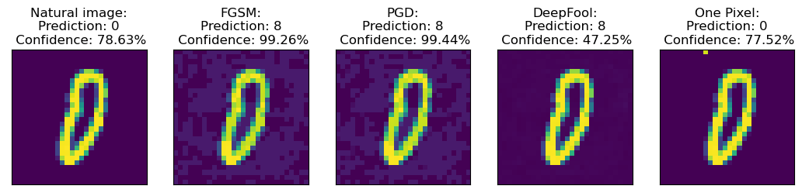

# Adversarial MNIST

I implement the Fast Gradient Sign Method (FGSM) by [Goodfellow et al.](https://arxiv.org/abs/1412.6572), Projected Gradient Descent (PGD) by [Madry et al.](https://arxiv.org/abs/1706.06083), DeepFool by [Moosavi-Dezfooli et al.](https://arxiv.org/abs/1511.04599), and the One-Pixel attack by [Su et al.](https://arxiv.org/abs/1710.08864).
(In the future, I also plan to implement the adversarial patch method.)

I then train a simple Dense neural network on MNIST, and see how it is affected by these attacks. As one would expect, its accuracy drops precipitously when faced with adversarial examples from the FGSM and PGD attacks. 

I then fine-tune this neural network on constructed adversarial examples to yield an adversarially robust neural network. As suggested by [Jeddi et al.](https://arxiv.org/abs/2012.13628), I use a learning rate schedule which gradually warms up, and then cools down.
They suggest that this yields a neural network which does not overfit on the adversarial examples, and forgets the distribution of natural images. In the simple case of MNIST, I find that this learning rate schedule does not make a difference, and even a fixed learning rate yields a robust network.

Unlike the FGSM and PGD methods, which may or may not yield images which fool the network, the DeepFool algorithm is designed to find the minimal perturbation that leads to a misclassification by the neural network.

The One-Pixel attack, as suggested by its name, is an attack that is only allowed to modify one pixel of the image. Moreover, unliked the previous methods, it is a black box attack, meaning it can only query the neural network. It does not need to know the neural network's architecture or weights.

## Example of the implemented attacks

